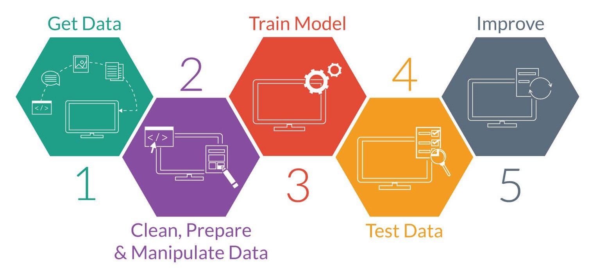
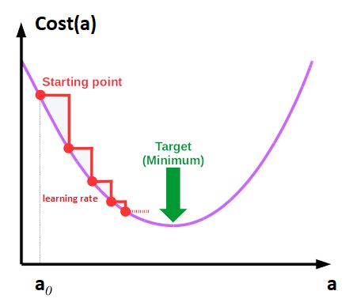

# what-is-machine-learning

## _Description du projet_

Ce projet a pour but de nous faire réaliser une veille sur les différentes notions liées au Machine Learning (apprentissage automatique), afin d'aborder sereinement cette pierre angulaire de l'Intelligence Artificielle.  
Les notions sur lesquelles nous devons réaliser cette veille sont les suivantes:

- [ ] La science des données
- [ ] L’apprentissage automatique et l’apprentissage profond
- [ ] L'apprentissage suprvisé
- [ ] L'apprentissage non-supervisé
- [ ] La classification supervisée
- [ ] La classification non supervisée
- [ ] La régression
- [ ] La validation croisée
- [ ] Les données d’entraînement, les données de test et de validation
- [ ] Corrélation linéaire (de Pearson) entre deux variables
- [ ] Une fonction de coût
- [ ] La descente de gradient

Vous retrouverez dans la partie suivante les définitions accompagnées de quelques exemples pour chacune de ces notions.

## _Veille_

### **La science des données**

_Définition:_  
La science des données est l'étude des données afin d'en extraire des informations significatives. Il s'agit d'une approche pluridisciplinaire qui combine des principes et des pratiques issus des domaines des mathématiques, des statistiques, de l'intelligence artificielle et du génie informatique, en vue d'analyser de grands volumes de données. Cette analyse aide les scientifiques des données à poser des questions et à y répondre, comme Que s'est-il passé, Pourquoi cela s'est-il passé, Que va-t-il se passer et Que peut-on faire avec des résultats.

_A quoi sert la Science des données ?_  
La science des données sert à étudier les données de quatre principales manières :

1. Analyse descriptive
   **L'analyse descriptive** examine les données afin d'obtenir des informations sur ce qui s'est passé ou ce qui se passe dans l'environnement des données. Elle se caractérise par des visualisations de données telles que des diagrammes à secteurs, des histogrammes, des graphiques linéaires, des tableaux ou des récits générés. Par exemple, un service de réservation de vols peut enregistrer des données telles que le nombre de billets réservés chaque jour. L'analyse descriptive révélera alors les pics de réservation, les creux de réservation et les mois les plus performants pour ce service.

2. Analyse diagnostique
   **L'analyse diagnostique** est une plongée en profondeur ou un examen détaillé des données visant à comprendre pourquoi quelque chose s'est produit. Elle se caractérise par des techniques telles que l'analyse détaillée, la découverte de données, l'exploration de données et les corrélations. De multiples opérations et transformations de données peuvent être effectuées sur un jeu de données donné pour détecter des modèles uniques dans chacune de ces techniques. Par exemple, le service de vol peut analyser en détail un mois particulièrement performant pour mieux comprendre le pic de réservation. Par conséquent, il est possible de détecter que de nombreux clients se rendent dans une ville donnée pour assister à un événement sportif mensuel.

3. Analyse prédictive
   **L'analyse prédictive** utilise des données historiques pour faire des prévisions précises sur des modèles de données qui pourraient se présenter à l'avenir. Elle se caractérise par des techniques telles que le machine learning, la prédiction, la comparaison de modèles et la modélisation prédictive. Dans chacune de ces techniques, les ordinateurs sont formés à l'ingénierie inverse des liens de causalité dans les données. Par exemple, l'équipe du service des vols pourrait utiliser la science des données pour prédire les modèles de réservation de vols pour l'année suivante au début de chaque année. De même, le programme informatique ou l'algorithme peut analyser des données antérieures et prévoir des pics de réservation pour certaines destinations au mois de mai. Ayant anticipé les futurs besoins de voyage de ses clients, l'entreprise pourrait commencer à faire de la publicité ciblée pour ces villes à partir de février.

4. Analyse prescriptive
   **L'analytique prescriptif** permet de faire passer les données prédictives au niveau supérieur. Elle ne se contente pas de prédire ce qui risque de se produire, mais elle propose aussi une réponse optimale à ce résultat. Elle peut analyser les implications potentielles de différents choix et recommander la meilleure ligne de conduite. Elle utilise les analyses graphiques, la simulation, le traitement des événements complexes, les réseaux neuronaux et les moteurs de recommandation issus du machine learning.

Source: **Amazon Web Services**

_Illustration_  

### **L'apprentissage automatique & l'apprentissage profond (Machine Learning & Deep Learning)**

_Définitions:_  
**Le Machine Learning** ou apprentissage automatique est un domaine scientifique, et plus particulièrement une sous-catégorie de l’intelligence artificielle. Elle consiste à laisser des algorithmes découvrir des « patterns », à savoir des motifs récurrents, dans les ensembles de données. Ces données peuvent être des chiffres, des mots, des images, des statistiques…

**Le Deep Learning** quant à lui est un sous-ensemble du Machine Learning où les réseaux neuronaux artificiels - des algorithmes conçus pour fonctionner comme le cerveau humain - apprennent à partir d'un grand nombre de données.

_Comment tout cela fonctionne t'il ?_  
Le fonctionnement du **Machine Learning** repose sur 4 étapes principales:

1. Sélectionner et préparer un ensemble de données d'entrainement qui seront utilisées pour nourrir le modèle de Machine Learning pour apprendre à résoudre des problèmes pour lequel il est conçu.  
   Les données peuvent être étiquettées (labelisées) pour indiquer au modèle les caractéristiques qu'il devra identifier. Si elles ne sont pas étiquettées le modèle devra repérer et extraire les caractéristiques récurrentes de lui même.

2. Sélectionner un algorithme a éxécuter sur l'ensemble des données d'entrainement. Le choix dépend du type et du volume des données d'entrainement et du type de problème à résoudre.

3.Entrainer l'algorithme. C'est un processus itératif. Des variables sont exécutées à travers l'algorithme et les résultats sont comparés avec ceux qu'il aurait pu produire. Les poids et le biais peuvent ensuite être ajustés pour accroître la précision du résultat. On exécute ensuite de nouveau les variables jusqu’à ce que l’algorithme produise le résultat correct la plupart du temps. L’algorithme, ainsi entraîné, est le modèle de Machine Learning.

4. Utiliser et améliorer le modèle. On utilise le modèle sur de nouvelles données, dont la provenance dépend du problème à résoudre.Par exemple, un modèle de Machine Learning conçu pour détecter les spams sera utilisé sur des emails.

Le **Deep Learning** est alimenté par des couches de réseaux neuronaux, qui sont des algorithmes vaguement modelés sur le fonctionnement du cerveau humain. L'entraînement avec de grandes quantités de données permet de configurer les neurones du réseau neuronal. Le résultat est un modèle de deep learning qui, une fois entraîné, traite de nouvelles données. Les modèles de deep learning recueillent des informations provenant de plusieurs sources de données et analysent ces données en temps réel, sans intervention humaine. Dans le cadre du deep learning, les processeurs graphiques (GPU) sont optimisés pour la formation de modèles, car ils peuvent traiter plusieurs calculs simultanément.

Sources: **datascientest.com & oracle.com**

_Illustration_  

### **Apprentissage supervisé**

_Définition:_  
**L'apprentissage supervisé**, également appelé **apprentissage automatique supervisé**, est une sous-catégorie de **l'apprentissage automatique** et de l'intelligence artificielle. Il se caractérise par l'utilisation de jeux de données **étiquetés** qui entraînent des algorithmes permettant de **classer** des données ou de **prédire** des résultats avec précision. Au fur et à mesure que les données en entrée sont introduites dans le modèle, celui-ci ajuste ses pondérations jusqu'à ce que le modèle soit correctement ajusté. C'est le processus de **validation croisée**.

_Fonctionnement:_
L'apprentissage supervisé utilise un jeu d'entraînement pour apprendre aux modèles à produire les résultats souhaités. Ce jeu de données d'apprentissage comprend des entrées et des sorties correctes, qui permettent au modèle d'apprendre au fil du temps. L'algorithme mesure sa précision par le biais de la fonction de perte, et s'ajuste jusqu'à ce que l'erreur soit suffisamment minimisée.

L'apprentissage supervisé peut être divisé en deux types de problèmes lors de l'extraction de données, à savoir la classification et la régression que nous verrons plus tard.

Source: **ibm.com**

_Illustration_  

### **Apprentissage non-supervisé**

_Définition:_
**L'apprentissage non supervisé**, ou **apprentissage automatique non supervisé**, utilise des algorithmes d'apprentissage automatique pour **analyser** et **regrouper** des jeux de données **non étiquetés**. Ces algorithmes découvrent des modèles cachés ou des groupements de données sans nécessiter **d'intervention humaine**. Sa capacité à découvrir les similitudes et les différences d'informations en fait la solution idéale pour l'analyse d'exploration des données, les stratégies de vente croisée, la segmentation de la clientèle et la reconnaissance d'images.

Source: **ibm.com**

_Illustration_  

### **Classification supervisée**

_Définition:_
Le classement automatique ou classification supervisée est la catégorisation algorithmique d'objets. Elle consiste à attribuer une classe ou catégorie à chaque objet (ou individu) à classer, en se fondant sur des données statistiques. Elle fait couramment appel à l'apprentissage automatique et est largement utilisée en reconnaissance de formes.  
L'objectif de la classification supervisée est principalement de définir des règles permettant de classer des objets dans des classes à partir de variables qualitatives ou quantitatives caractérisant ces objets. Les méthodes s'étendent souvent à des variables Y quantitatives (régression).

_Fonctionnement:_
On dispose au départ d'un échantillon dit d'apprentissage dont le classement est connu. Cet échantillon est utilisé pour l'apprentissage des règles de classement. Il est nécessaire d'étudier la fiabilité de ces règles pour les comparer et les appliquer, évaluer les cas de sous apprentissage ou de sur apprentissage (complexité du modèle). On utilise souvent un deuxième échantillon indépendant, dit de validation ou de test.

Source: **Wikipedia**

_Illustration_  

### **Classification non supervisée**

_Définition:_
Contrairement à la classification supervisée, où les modèles sont entraînés sur des données étiquetées, la classification non supervisée travaille avec des données non étiquetées. Le but est de découvrir des motifs, des groupes (clusters) ou des structures cachées dans les données sans aucune intervention ou guidage humain.

_Fonctionnement:_
Dans la classification non supervisée, l'algorithme essaie de regrouper les données en différentes catégories ou clusters sur la base de leur similarité sans connaître les réponses ou les étiquettes à l'avance. Les points de données qui se ressemblent beaucoup (selon certains critères de similarité) sont placés dans le même groupe, et ceux qui diffèrent significativement sont placés dans des groupes différents.

Source: **ChatGPT**

### **Régression**

_Définition:_  
**La régression**, dans le contexte de l'IA et de l'apprentissage automatique, est une méthode statistique qui vise à établir une relation entre une variable dépendante (ce que nous voulons prédire) et une ou plusieurs variables indépendantes (les entrées ou caractéristiques). L'objectif est de comprendre cette relation et de l'utiliser pour faire des prédictions précises.
La régression est utilisée pour comprendre la relation entre les variables dépendantes et indépendantes. Elle est couramment utilisée pour faire des projections, par exemple, sur le chiffre d'affaires d'une entreprise. La régression linéaire, la régression logistique et la régression polynomiale sont des algorithmes de régression couramment utilisés.

Source: **Amazon Web Services**

**La régression linéaire:**  

**La régression logistique:**  

**La régression polynomiale:**  

### **Validation Croisée**

_Définition:_  
En statistiques et en apprentissage automatique, la validation croisée (cross-validation en anglais) est une méthode d’estimation de fiabilité d’un modèle fondée sur une technique d’échantillonnage. Lorsqu'on entraîne un modèle sur des données étiquetées, on émet l'hypothèse qu'il doit également fonctionner sur de nouvelles données. Elle permet de minimiser le problème de surajustement (overfitting).

_Fonctionnement:_
Dans un premier temps nous devons diviser les données en fonction du nombre de plis. Pour une validation croiée à 3 plus l'ensemble de données sera donc divisée en trois parties de taille plus ou moins égales. En suite le modèle est entraîné k fois, chaque fois en utilisant k-1 parties des données pour l'entraînement et la partie restante pour la validation. Ainsi, chaque partie des données sert exactement une fois comme ensemble de validation. Par exemple, dans une validation croisée à 5 plis, le modèle est entraîné 5 fois; chaque fois, 4 plis sont utilisés pour l'entraînement et 1 pli pour la validation. Puis on calcule l'erreur, à chaque itération, l'erreur de validation est calculée en utilisant l'ensemble de validation. Et pour terminer on calcule la moyenne de l'erreur après avoir effectué toutes les k itérations. Cette erreur moyenne sert d'estimation de la capacité du modèle à généraliser sur de nouvelles données.

_Illustration_  

### **Données d'entrainement, de test et de validation**

_Définitions & Usages:_

**Données d'entrainement:**
Un jeu de données d'apprentissage est un ensemble de données d'exemples utilisé pendant le processus d'apprentissage et est utilisé pour ajuster les paramètres d'un classificateur, par exemple.

Pour les tâches de classification, un algorithme d'apprentissage supervisé examine le jeu de données d'apprentissage pour déterminer, ou apprendre, les combinaisons optimales de variables qui généreront un bon modèle prédictif. L'objectif est de produire un modèle entraîné (ajusté) qui se généralise bien aux nouvelles données inconnues. Le modèle ajusté est évalué à l'aide de « nouveaux » exemples issus des jeux de données conservés pour estimer la précision du modèle dans la classification de nouvelles données. Pour réduire le risque de problèmes tels que le sur-apprentissage, les exemples des jeux de données de validation et de test ne doivent pas être utilisés pour entraîner le modèle.

La plupart des approches qui recherchent dans les données d'apprentissage des relations empiriques ont tendance à surajuster les données, ce qui signifie qu'elles peuvent identifier et exploiter des relations apparentes dans les données d'apprentissage qui ne sont pas valables en général.

**Données de test:**
Un jeu de données de test est un jeu de données indépendant du jeu de données d'apprentissage, mais qui suit la même distribution de probabilité que le jeu de données d'apprentissage. Si un modèle ajusté au jeu de données d'apprentissage s'adapte également bien au jeu de données de test, un surajustement minimal a eu lieu. Un meilleur ajustement du jeu de données d'apprentissage par opposition au jeu de données de test indique généralement un surajustement.

Un jeu de test est donc un jeu d'exemples utilisés uniquement pour évaluer les performances d'un classificateur entièrement spécifié. Pour ce faire, le modèle final est utilisé pour prédire les classifications des exemples dans le jeu de test. Ces prédictions sont comparées aux véritables classifications des exemples pour évaluer la précision du modèle.

Dans un scénario où les jeux de données de validation et de test sont utilisés, le jeu de données de test est généralement utilisé pour évaluer le modèle final sélectionné au cours du processus de validation. Dans le cas où le jeu de données d'origine est partitionné en deux sous-ensembles (jeu de données d'entraînement et de test), le jeu de données de test peut évaluer le modèle une seule fois.

**Données de validation:**
Un jeu de données de validation est un jeu de données d'exemples utilisés pour régler les hyperparamètres (c'est-à-dire l'architecture) d'un classifieur. Un exemple d'hyperparamètre pour les réseaux de neurones artificiels comprend le nombre d'unités cachées dans chaque couche. Celui-ci, ainsi que le jeu de test, doit suivre la même Loi de probabilité que le jeu de données d'apprentissage.

Afin d'éviter le surapprentissage, lorsqu'un paramètre de classification doit être ajusté, il est nécessaire de disposer d'un jeu de données de validation en plus des jeux de données d'apprentissage et de test. Par exemple, si le classificateur le plus approprié pour le problème est recherché, le jeu de données d'apprentissage est utilisé pour entraîner les différents classificateurs candidats, le jeu de données de validation est utilisé pour comparer leurs performances et décider lequel prendre et, enfin, le jeu de test est utilisé pour obtenir les caractéristiques de performance telles que la précision, la sensibilité, la spécificité, la mesure F, etc. Le jeu de données de validation fonctionne comme un hybride : ce sont des données d'entraînement utilisées pour les tests, mais ni dans le cadre de la formation de bas niveau ni dans le cadre du test final.

Une application de ce processus est en arrêt anticipé, où les modèles candidats sont des itérations successives du même réseau, et la formation s'arrête lorsque l'erreur sur le jeu de validation augmente, en choisissant le modèle précédent (celui avec l'erreur minimale).

_Illustration_  

### **Corrélation linéaire**

_Définition:_  
Le coefficient de corrélation de Pearson, également connu sous le nom de coefficient r, est une mesure statistique qui définit la force de la relation entre deux variables et leur association l’une avec l’autre.
En termes simples, le coefficient de corrélation de Pearson détermine tout changement dans une variable qui est influencé par l’autre variable liée. Le coefficient de corrélation de Pearson est influencé par le concept de covariance, ce qui en fait une meilleure méthode pour déterminer la relation et l’interdépendance entre les deux variables.

_Illustration_  

### **Fonction de coût**

_Définition:_  
Dans le domaine de l’intelligence artificielle, la fonction de perte ou de coût est la quantification de l’écart entre les prévisions du modèle et les observations réelles du jeu de donnée utilisé pendant l’entraînement.

### **Déscente de gradient**

_Définition:_  
La descente de gradient est un algorithme d'optimisation couramment utilisé pour entraîner des modèles d'apprentissage automatique et des réseaux neuronaux. Les données d'entraînement aident ces modèles à apprendre au fil du temps, et la fonction de coût dans la descente de gradient agit spécifiquement comme un baromètre, évaluant sa précision à chaque itération des mises à jour des paramètres. Jusqu'à ce que la fonction soit proche de zéro ou égale à zéro, le modèle continue à ajuster ses paramètres pour obtenir l'erreur la plus faible possible. Une fois que les modèles d'apprentissage automatique sont optimisés et acquièrent une précision satisfaisante, ils peuvent se révéler des outils puissants pour l'intelligence artificielle (IA) et les applications informatiques.

_Illustration_  

